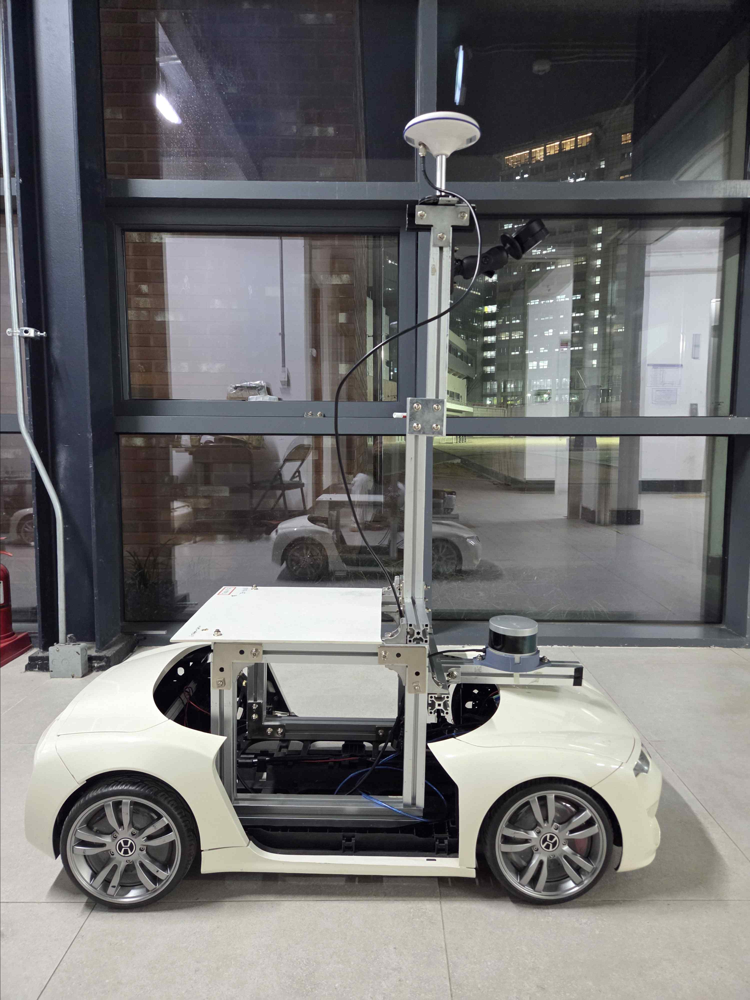
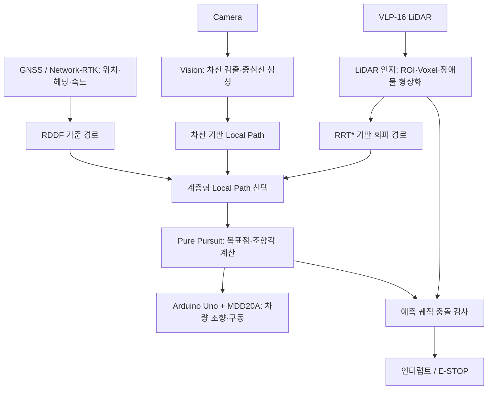
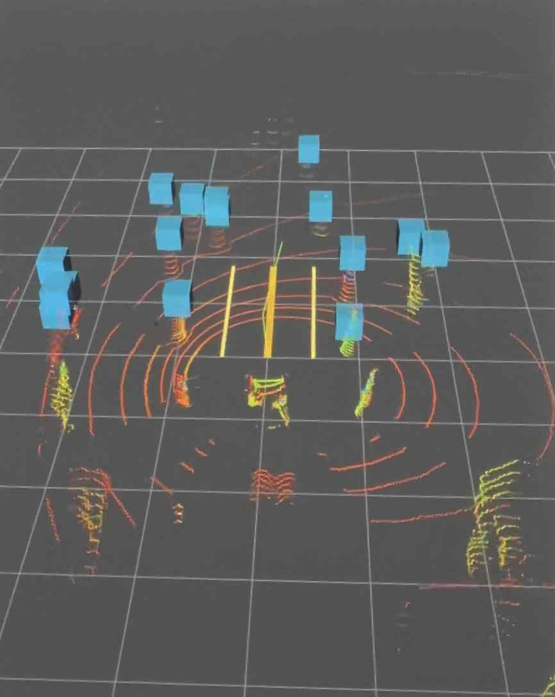
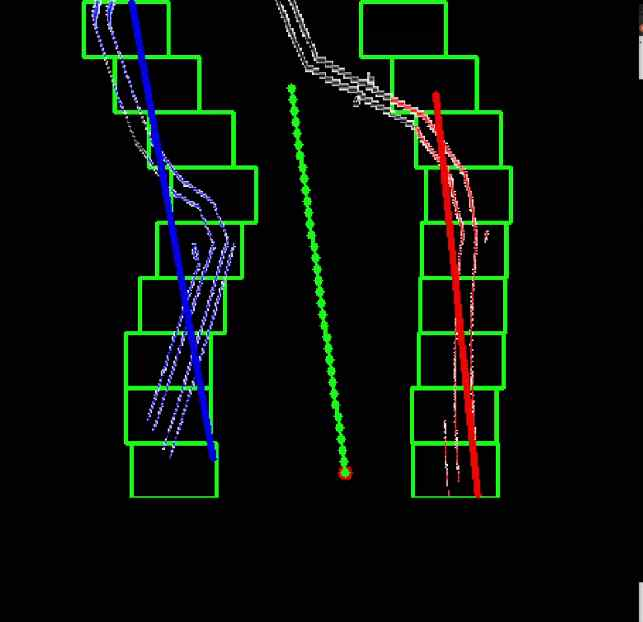
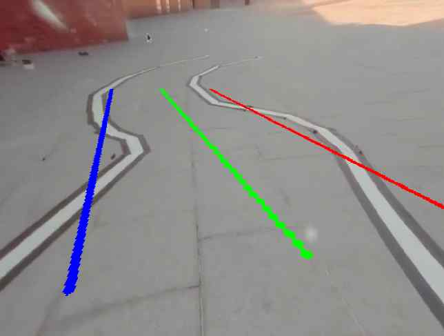

# Stier 자율주행 모빌리티 시스템

> 홍익대학교 자율주행차 동아리 Stier  
> 자율주행 모빌리티 경진대회에 출전한 ROS 소프트웨어


|.png)|%202.png)|
|---|---|

## 프로젝트 개요

헤네스 F8 플랫폼 위에 GNSS, LiDAR, 카메라를 결합한 자율주행 시스템입니다. 전역 기준 경로(RDDF)를 바탕으로 주행하되, 주변 환경에 따라 차선 경로 또는 장애물 회피 경로를 실시간으로 선택합니다. 선택된 경로는 Pure Pursuit 제어기로 조향 명령으로 변환되며, 예측 궤적 기반 안전 감시가 동적 장애물에 대응합니다.



*보고서 그림 3 - 센서와 알루미늄 프로파일 프레임을 적용한 차량 구성*

## 시스템 아키텍처



### 경로 선택 우선순위

1. LiDAR 기반 장애물 회피 경로
2. Vision 기반 차선 경로
3. RDDF 기반 기준 경로

이 구조는 전역 주행 방향을 유지하면서도 장애물과 차선 상태 같은 지역 환경 변화에 반응하도록 설계되었습니다.

## 하드웨어 구성

| 구분 | 구성 | 배치 및 역할 |
| --- | --- | --- |
| 차량 플랫폼 | 헤네스 F8 | 자율주행 차량 베이스 |
| GNSS | ANN-MB-02 수신기, u-blox ZED-F9P | 정밀 위치, 헤딩, 속도 획득. 안테나 오프셋은 후륜 축 중심 기준으로 보정 |
| 카메라 | Razer Kiyo Pro | 차량 중앙에서 전방 약 30 cm, 높이 1.2 m. 60도 하향 설치로 양쪽 차선 관측 |
| LiDAR | Velodyne VLP-16 | 차량 중앙에서 전방 약 30 cm, 높이 0.5 m. 정적·동적 장애물 인지 |
| 연산 및 제어 | MSI GP76N011 노트북, Arduino Uno, MDD20A | 인지·판단 연산과 저수준 차량 제어 |
| 전원 | 12 V 12 Ah LiFePO4 배터리, PB305W-UPS | 차량 및 연산 장치 전원 공급 |

## 환경 인지

### GNSS: 정밀 위치와 전역 좌표

- ZED-F9P와 `ros-agriculture/ublox_f9p` 패키지로 GNSS 데이터를 수신합니다.
- `/ublox_gps/fix`에서 위도·경도·고도와 Fix 상태를, `/ublox_gps/NavPVT`에서 속도와 헤딩을 활용합니다.
- Network-RTK로 위치 오차를 보정하고, `ROS-UTM-LLA`를 통해 WGS-84 위도·경도를 UTM Zone 52N 평면 좌표로 변환합니다.
- 저속 구간의 헤딩 불안정을 줄이기 위해 이전의 정상 헤딩을 참조하는 보정 로직을 둡니다.

### LiDAR: ROI부터 장애물 메타데이터까지

VLP-16은 Single Return / Strongest 모드와 600 RPM으로 설정해 근거리 장애물 인지에 초점을 맞춥니다. ROS에서는 `velodyne-driver`와 `velodyne_pointcloud`를 사용해 포인트클라우드를 수신합니다.

| 처리 단계 | 방식 | 보고서 기준 설정 |
| --- | --- | --- |
| ROI 필터링 | PCL PassThrough 필터를 `z → x → y` 순서로 적용 | 전방 `0-5 m`, 좌우 `-3-3 m`, 높이 `0.2-0.4 m` |
| 노면 노이즈 제거 | z축 하한 설정 | `z ≥ 0.2 m` |
| 객체 형상화 | Voxel Grid 압축 후 축 정렬 바운딩 박스 생성 | Voxel 크기 `0.7 m` |
| 미래 궤적 | Kinematic Bicycle Model로 거리 기반 경로점 적분 | 현재 속도·조향각·휠베이스 반영 |

필터링된 ROI 점군은 `/roi_raw`로 발행되며, 후단 모듈은 바운딩 박스 형태의 고정 길이 객체 정보를 사용해 빠르게 충돌 여부를 판단합니다.



*보고서 그림 12 - Voxel 기반 라바콘 형상화 결과*

### Vision: 차선에서 주행 경로까지

1. RGB 영상을 그레이스케일로 변환하고 Bilateral Filter와 Canny Edge Detection을 적용합니다.
2. 카메라 왜곡을 보정한 뒤 Homography 기반 IPM(Inverse Perspective Mapping)으로 BEV 시점 영상을 만듭니다.
3. 초기 탐색 또는 추적 실패 시에는 Sliding Window로 좌우 차선을 찾고 다항식 피팅을 수행합니다.
4. 연속 프레임에서는 Around Poly로 이전 차선 모델 주변만 탐색해 연산량을 줄입니다.
5. 동적 중심점, 차선 폭·위치 유효성 검사, EMA 평활화, 일시적 소실 시 이전 모델 유지로 추적을 안정화합니다.
6. 좌우 차선의 중간값으로 중심선을 만들고, BEV 픽셀 좌표를 차량 기준 좌표로 바꿔 `Path` 형태의 local path를 발행합니다. 한쪽 차선만 보일 때는 차선 폭 또는 단일 차선 오프셋으로 중심선을 보완합니다.



*보고서 그림 19 - Sliding Window 기반 차선 인식 결과*



*보고서 그림 22 - 차선 인식 기반 최종 경로 생성 결과*

## 판단 및 제어

### 계층형 Local Path Planning

상위 판단 계층은 RDDF, Vision, LiDAR가 제공하는 후보 경로 중 현재 상황에 맞는 하나를 선택합니다. 따라서 단순 waypoint 추종이 아니라 전역 경로와 센서 기반 지역 경로를 통합하는 구조입니다.

### Pure Pursuit 경로 추종

선택된 경로에서 현재 위치로부터 예견거리(`Ld`) 이상 떨어진 첫 번째 점을 목표점으로 잡습니다. 해당 점이 없으면 경로의 마지막 점을 사용합니다. 차량의 위치·헤딩과 목표점의 상대각 `α`를 이용해, 기구학적 자전거 모델 기반의 조향각을 계산합니다.

```text
δ = atan(2L · sin(α) / Ld)
```

- 경로 종류와 주행 상황에 따라 예견거리를 다르게 적용합니다.
- 조향각은 차량의 기계적 한계 안으로 제한하고, 일반 상황에서는 평활화와 변화율 제한을 적용합니다.
- 긴급 정지 상황은 조향 필터링보다 안전을 우선합니다.

### 정적 장애물 회피

- 조향각에 따라 휘어지는 곡선 ROI 안에서 장애물의 지속 존재 여부를 판단합니다.
- 전방 조향 가능 각도 안에서만 후보 노드를 생성하는, 차량 주행에 맞게 변형한 RRT*를 사용합니다.
- 거리뿐 아니라 조향 변화량과 장애물 여유 공간(clearance)을 함께 비용으로 고려합니다.
- 장애물 사이에서 가장 넓은 통로의 중앙을 동적 목표점으로 잡고, 횡방향 목표점에는 `α = 0.3`의 EMA를 적용해 급격한 경로 변화를 줄입니다.

### 동적 장애물 안전 대응

현재 속도와 조향각으로 predicted path를 생성한 뒤, 속도와 look-ahead time에 따라 정해지는 ROI에서 장애물 바운딩 박스와 충돌하는지 검사합니다. 연속 검출·연속 미검출 조건 및 E-STOP 유지 시간을 함께 적용해 순간 오검출로 인한 불필요한 정지를 줄입니다.

```text
예측 궤적 생성 → ROI 충돌 검사 → 인터럽트 / E-STOP
```

## 전체 처리 흐름

```text
GNSS 위치·헤딩 ───────────────┐
Vision 차선 → 중심선 Path ────┼→ Local Path 선택 → Pure Pursuit → 조향·구동
LiDAR 점군 → 장애물/회피 Path ─┘                       │
                                                       └→ 예측 궤적 안전 감시 → E-STOP
```

## 주요 ROS 인터페이스

| 구분 | 인터페이스 | 용도 |
| --- | --- | --- |
| GNSS | `/ublox_gps/fix` | 위도·경도·고도 및 Fix 상태 |
| GNSS | `/ublox_gps/NavPVT` | 속도 및 헤딩 |
| LiDAR | `/scan` | VLP-16 포인트클라우드 기반 LaserScan 데이터 |
| LiDAR | `/roi_raw` | ROI 필터링 결과 확인 |
| Vision | `Path` | 차량 좌표계로 변환된 차선 기반 local path |


## 출처

- 원본: 홍익대학교 STier, *Intermediate 자율주행 모빌리티 경진대회 1/5 기술보고서* (22쪽)
- 지도교수: 김의호
